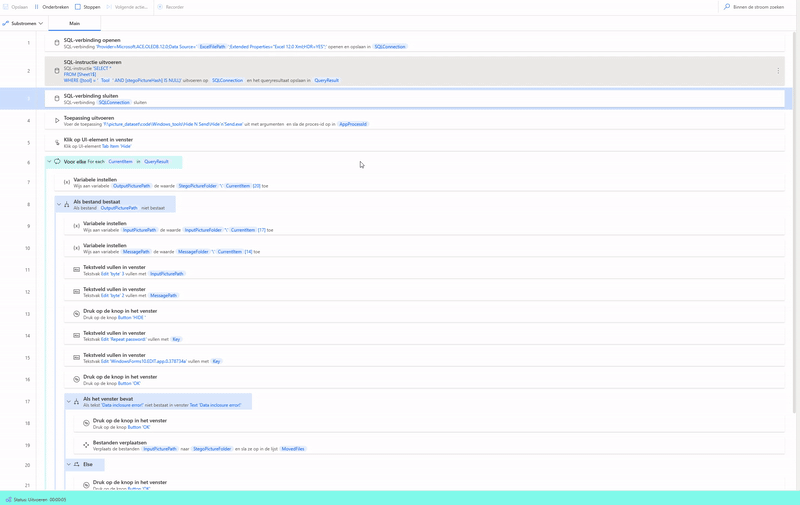

# REVEAL: A Large-Scale Comprehensive Dataset for Steganalysis

This repository contains all the code for creating, 
visualizing and evaluating the REVEAL dataset!

Required Python version == 3.10

## Stego Tools

The steganography tools that were used to create this dataset have not been included in this repository and
can be downloaded separately.
However, the [apply_modifications_and_generate_stego_commands.py](/creation/apply_modifications_and_generate_stego_commands.py) file does contain all commands that have been used
to create stego images with the command line based tools. 
In order to create stego images for GUI based tools like Hide'N'Send, [Microsoft Power Automate](https://www.microsoft.com/en-us/power-platform/products/power-automate) was used to automate
clicking various buttons. Unfortunately, this application did not provide a way to share the automation scripts, but
the GIF below gives a small impression of how this was done.

